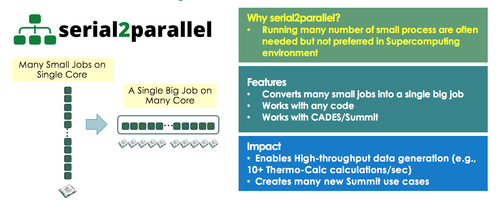

# Serial2Parallel

Serial2Parallel: Running any serial scripts in parallel on an MPI cluster!

In the era of machine learning, we often need to run the same code/script many times with little or no variations (e.g., performance evaluation, data preprocessing, data generation, hyperparameter tuning, etc.). It is not a problem when you just need to do that a few times, but when the number of repetitions becomes very large, 
it can be a daunting task. 

And yes, that often happens, for example, you may want to run thousands of machine learning training for finding the best hyperparameters. There are tools and libraries to help users to write their parallel codes, but this can be a problem if, 

- Users are not programming experts.
- Users need to use existing software (e.g., commercial simulation tool) that cannot be modified.

This `Serial2Parallel` provides an easy way for users to be able to run many numbers of 
any serial code/scripts in a parallel manner across multiple nodes in an MPI cluster.

# How to use

```
usage: server.py [-h] [--host HOST] [--script SCRIPT] [--port PORT] [--chunksize CHUNKSIZE]

optional arguments:
  -h, --help            show this help message and exit
  --host HOST           server hostname
  --script SCRIPT       script file location
  --port PORT           server port
  --chunksize CHUNKSIZE
                        how many scripts to deligate to client at once

```
- Please edit `scripts.sh` and add commands as you need. Each line will be distributed and run across multiple nodes.
- Running `server.py` will get your scripts to be added to the script pool and wait for requests from clients.

```
$ python server.py --host localhost --port 9999 --chunksize 1
Serial2Parallel Server v0.1 by Matt Lee

Please add lines in scripts/scripts.txt
126 scripts ready in que
--------------------------------------------
Waiting for client request ..
```

- `chunksize` means the number of scripts that are assigned to a client at once, and the default value is 1.
- `host` is for the server's hostname. The default value is `localhost`
- `port` is for the server's port number. The default value is 9999.

- Now you can run the scripts in parallel using MPI. For instance, `mpiexec -n 4 python s2p.py --host localhost --port 9999`
will start up 4 processes. You can specify your hostname and port number.
- Note that clients need to be set up appropriately for the commands that you included in the `scripts.sh`

```
$ mpiexec -n 4 python s2p.py --host localhost --port 9999
MPI client started running scripts in parallel: this process is rank = 3, total # of processes: 4
1 / 1  rank =  3   5.005801200866699  sec elapsed to process a script
MPI client started running scripts in parallel: this process is rank = 0, total # of processes: 4
1 / 1  rank =  0   5.005622148513794  sec elapsed to process a script
MPI client started running scripts in parallel: this process is rank = 1, total # of processes: 4
1 / 1  rank =  1   5.005718946456909  sec elapsed to process a script
MPI client started running scripts in parallel: this process is rank = 2, total # of processes: 4
1 / 1  rank =  2   5.005543231964111  sec elapsed to process a script
1 / 1  rank =  2   5.008765935897827  sec elapsed to process a script
1 / 1  rank =  3   5.008672714233398  sec elapsed to process a script
1 / 1  rank =  0   5.009006977081299  sec elapsed to process a script
1 / 1  rank =  1   5.008861303329468  sec elapsed to process a script```
...
```

- Enjoy!

# Note
- This software is for running many jobs in parallel (embarrassingly parallel) on many nodes, 
not for running a single big job on many nades (this will require a magic!)

# License
Please contact the developer, Matt Lee (lees4@ornl.gov) for more details.
